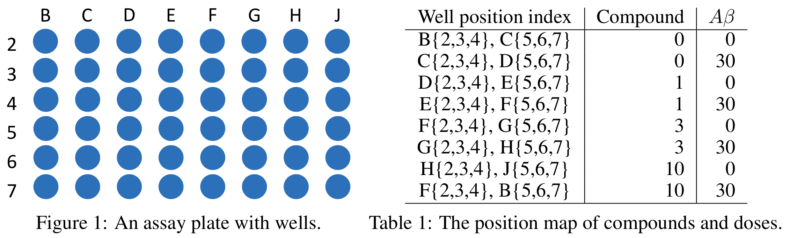
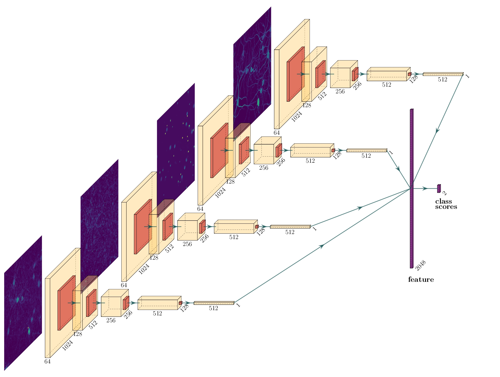

# Neuron-Image-Classification
 

# Background
In this work, we aim to build an end-to-end pipeline to estimate treatment effects of Amyloid-β compound in neuronal cells. The pipeline can be further applied to biomedical research to efficiently identify new compounds that protect cells against the treatment of Amyloid-β with potential to discover new drugs for the Alzheimer’s disease. This is a binary classification task where we aim to classify whether neurons are treated with Amyloid-β or not.

Previous work by [William Stone](https://github.com/wfbstone/Neuron-Image-Classification) has shown the potential of a CNN-based classifiers on this task. He implemented a VGG19 model and achieved 97.2% test accuracy. His training and testing neuron images were taken after staining with the Cy5 dye, a biomarker for the MAP2 gene found in the Neuronal Cytoskeleton. We aim to extend his work to make the model learn from four different stains. Specifically, we stained for MAP2 (neuronal cytoskeleton marker), PSD-95 (post-synaptic protein marker), Synaptophysin (pre-synaptic protein marker) and Hoescht 33342 (nucleic marker). Cells are then imaged at 40x and 20x using the high-content IN Cell Analyzer 6000 imaging system. The images are taken at the internal 48 wells per 96 well plate (the outer wells are lost to edge effects) and obtain 30 fields of view per well for each of the four channels. Cells are pre-treated for one hour with one candidate compound in doses of either 10, 3 or 1 μM2 before the addition of 30 μM of Aβ or a vehicle control. To train the classifier, we only use 0 and 30 μM of Aβ with 0 μM candidate compound. Then we apply the model to test whether candidate drugs have any effect. The plate configuration is shown below.

# Models
We first tried to stack four ResNet34 together by concatenating their feature vectors:

# Inference
